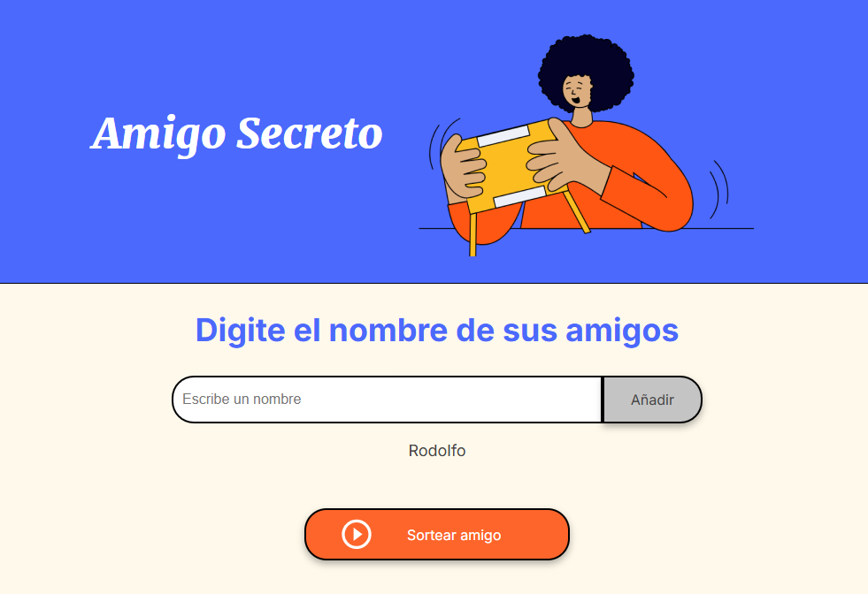
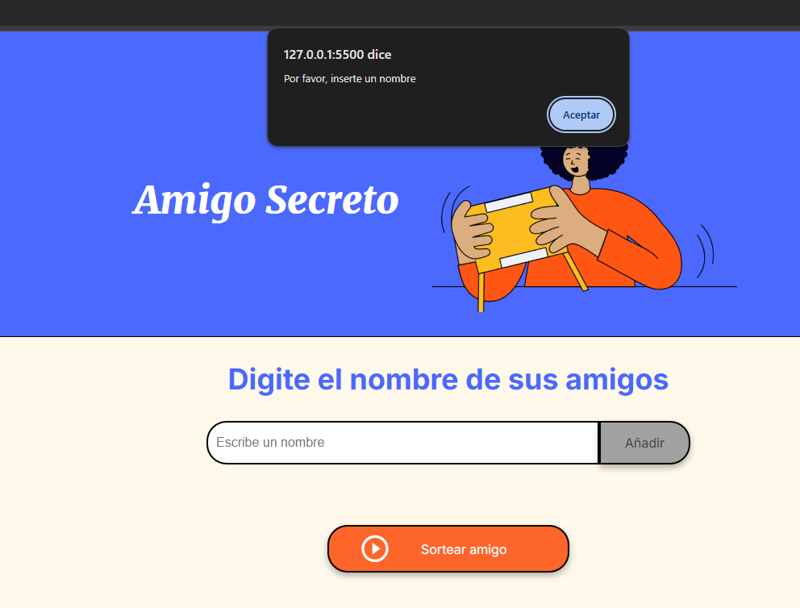
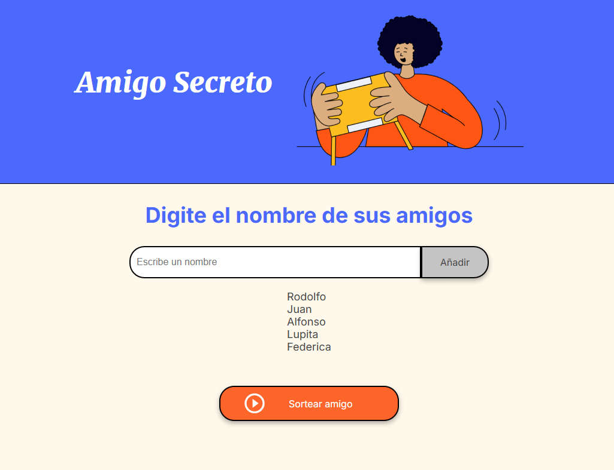
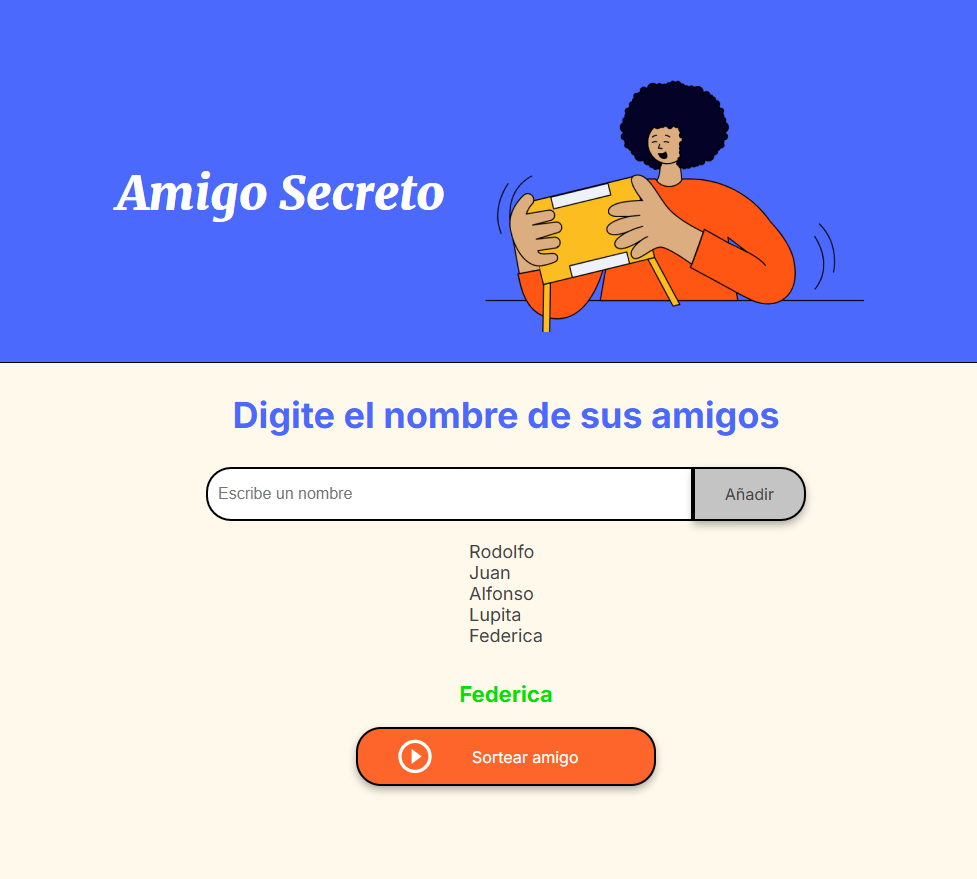

# Challenge Alura - Amigo Secreto

Aplicación que permite a los usuarios ingresar nombres en una lista, realizar un sorteo aleatorio y determinar quién es el **"Amigo Secreto"**. Los usuarios pueden agregar nombres a través de un campo de texto y un botón **"Añadir"**, visualizar la lista y, finalmente, hacer clic en **"Sortear Amigo"** para seleccionar un nombre aleatorio, mostrando el resultado en pantalla.

## Funcionalidad

- **Agregar nombres:** Los usuarios pueden ingresar nombres en un campo de texto y hacer clic en **"Añadir"** para agregarlos a la lista.

   

- **Validación de entrada:** Si el campo de texto está vacío o contiene caracteres no válidos, el sistema mostrará una alerta solicitando un nombre válido.

   

- **Visualización dinámica:** Los nombres ingresados aparecerán en una lista actualizada automáticamente debajo del campo de entrada.

   

- **Sorteo aleatorio:** Al hacer clic en el botón **"Sortear Amigo"**, el sistema seleccionará aleatoriamente un nombre de la lista y lo mostrará en pantalla.

   


### Instalación 

1. Clona el repositorio en tu máquina local:
    ```bash
    git clone https://github.com/RodolfoMedinaDEV/juego-secreto.git
    ```

2. Navega al directorio del proyecto:
    ```bash
    cd challenge-amigo-secreto_Rodolfo
    ```

3. Abre el archivo `index.html` en tu navegador para empezar a usar la aplicación.

### Ejecución 

Este proyecto no requiere ninguna instalación adicional. Simplemente abre el archivo `index.html` en tu navegador y empieza a usar la aplicación.
